# Передача управления DNS из timeweb.cloud в cloudflare

## Регистрация аккаунта cloudflare

1. Переходим по [этой ссылке](https://dash.cloudflare.com/sign-up) и регистрируем аккаунт Cloudflare.

2. После регистрации откроется страница с предложением ввести имя домена - вводим имя нужного домена и нажимаем `Continue`.

    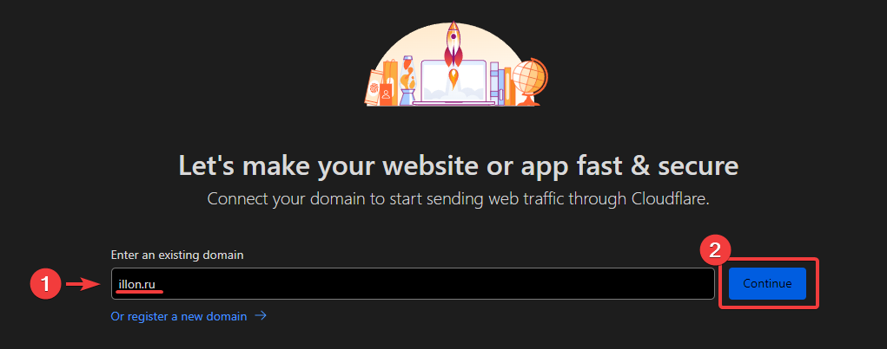

3. Выбираем тариф `Free 0$` внизу страницы. 

    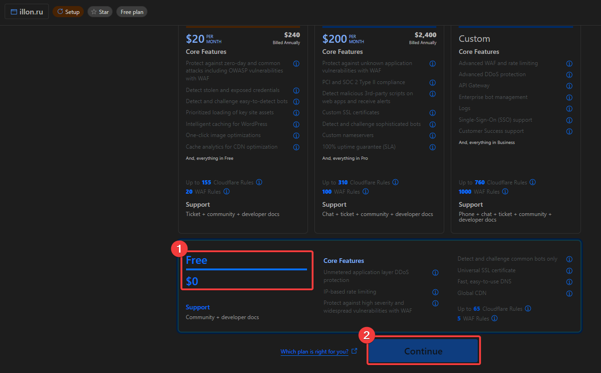

4. На открывшейся странице кликаем по имени домена.

    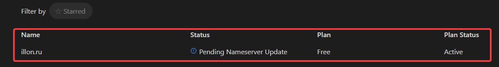

5. Внизу страницы будет адреса, вида: `*.ns.cloudflare.com`.

    Напротив каждого домена будет ссылка - "[Click to copy]()", после нажатия на эту ссылку адрес **копируется** в буфер обмена.

    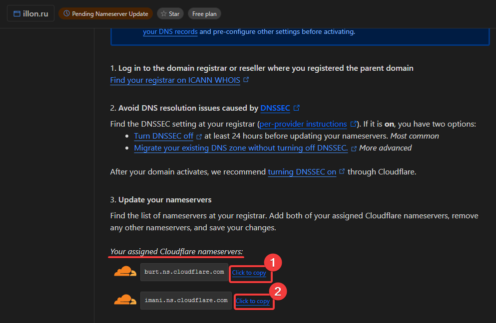

Эти домены - адреса NS-серверов cloudflare, далее мы укажем их в настрйоках нашего домена, в качестве первого и второго NS-сервера.

После замены NS-серверов регистратора домена на NS-сервера Cloudflare - управление DNS-записимя перейдет к Cloudflare.

Оставляем эту вкладку открытой, октрываем новую вкладку и переходим в https://timeweb.cloud/my/domains/.

## Вносим изменения в NS-записи (timeweb.cloud) домена

6. Выбираем нужный домен

    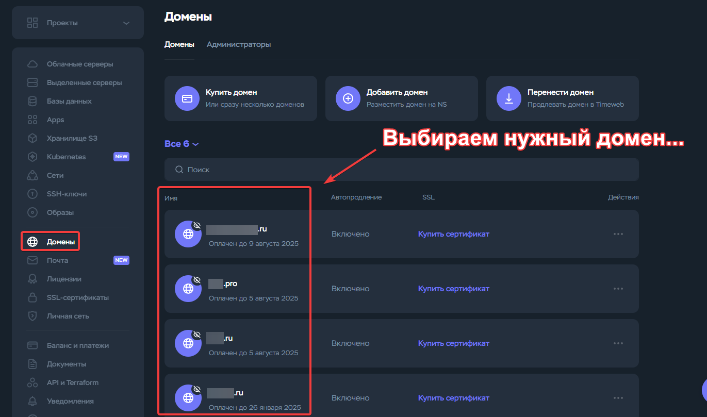

7. Находим строку `NS-серверы` и нажимаем на кнопку `Настроить` напротив.

    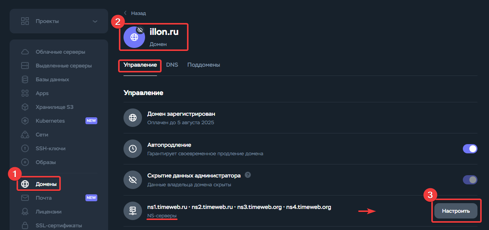

8. Вставляем два домена из вкладки с cloudflare в первые две строки.

9. Третью и четвертую запись удаляем, нажав кнопку `Удалить`.

10. Сохраняем изменения нажав кнопку `Сохранить`

    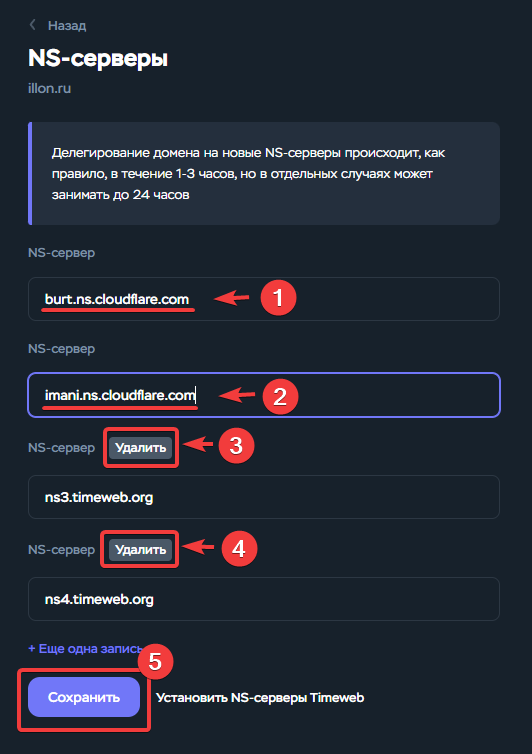

11. Теперь нужно дождаться вступления изменений в силу. Как правило, это происходит в течении 3-х часов, но может и затянуться.

    Вручную проверить статус можно нажав на кнопку `Check nameservers now` **на странице** домена в **Cloudflare**.

    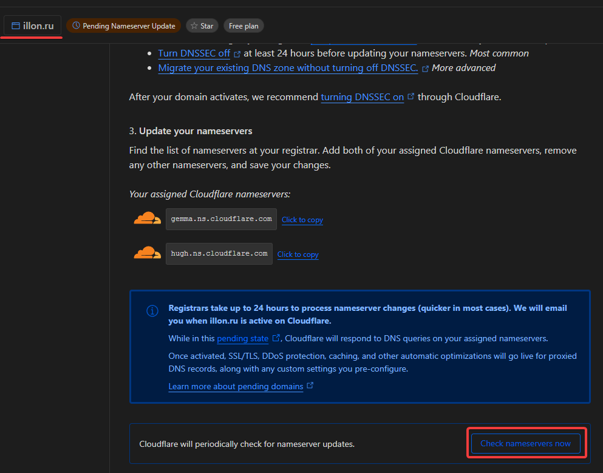

Когда изменения вступят в силу, напротив домена появится зеленая плашка с надписью `√ Active`.

## Добавляем DNS-запись

12. Теперь можно добавить DNS-запись, для этого кликаем по разделу `DNS` в столбце слева. 

    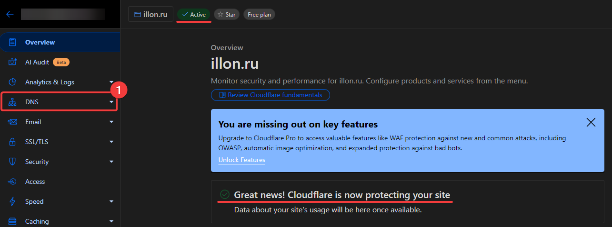

13. Нажимаем кнопку `+ Add record` справа.

14. В поле `Name` вводим желаемое имя.

15. В поле `IPv4 address` указываем адрес сервера.

16. Обязательно **отключаем** тумблер `Proxy status`, статус смениться на **DNS only**.

17. Сохраняем изменения нажав `Save`в правом нижнем углу.

    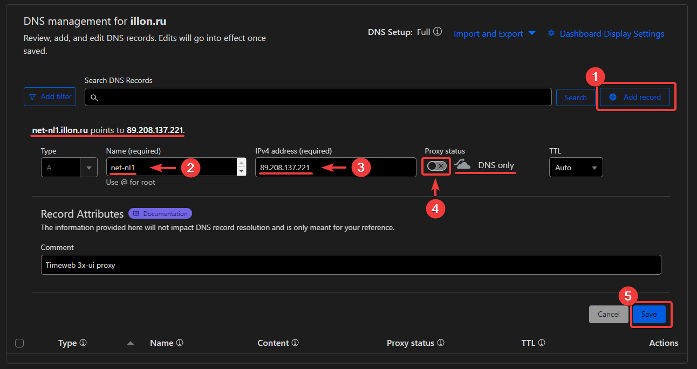

Проверить результат можно на https://zone.vision, для этого:

* Вводим в строку имя-что-мы-указали.наш-домен.ru

* Нажимаем `Enter`

* В строке с загловком `A` должен быть указанный нами ip-адрес.

    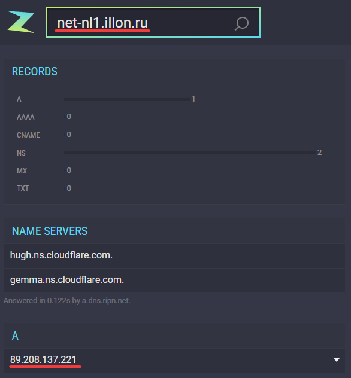